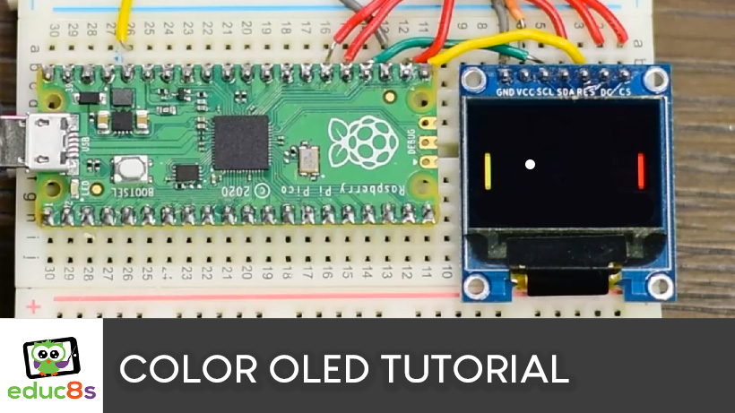

# CircuitPython Color OLED SSD1331 Examples

I created some simple projects with CircuitPython to help you get started with this Color OLED display.

1. Simple Hello World project.
2. A Pong Game
3. A project that displays and animated GIF icon that was converted into a Sprite Sheeet. The gif icon was converted using this tool: <a href="https://github.com/educ8s/Python-GIF-to-Sprite-sheet">GIF to Sprite Sheet</a>

# Video Tutorial

  

🎥 <a href="https://youtu.be/TGcLY4kgq2o">Video Tutorial on YouTube</a>

 
 

| 📺 <a href="https://www.youtube.com/educ8s">YouTube</a>
| 🌍 <a href="http://www.educ8s.tv">Website</a> |  

# Parts Needed
🛒 Color OLED ▶ http://educ8s.tv/part/ColorOLED

🛒 Raspberry Pi Pico ▶ http://educ8s.tv/part/RaspberryPiPico

💖 Full disclosure: All of the links above are affiliate links. I get a small percentage of each sale they generate. Thank you for your support!
